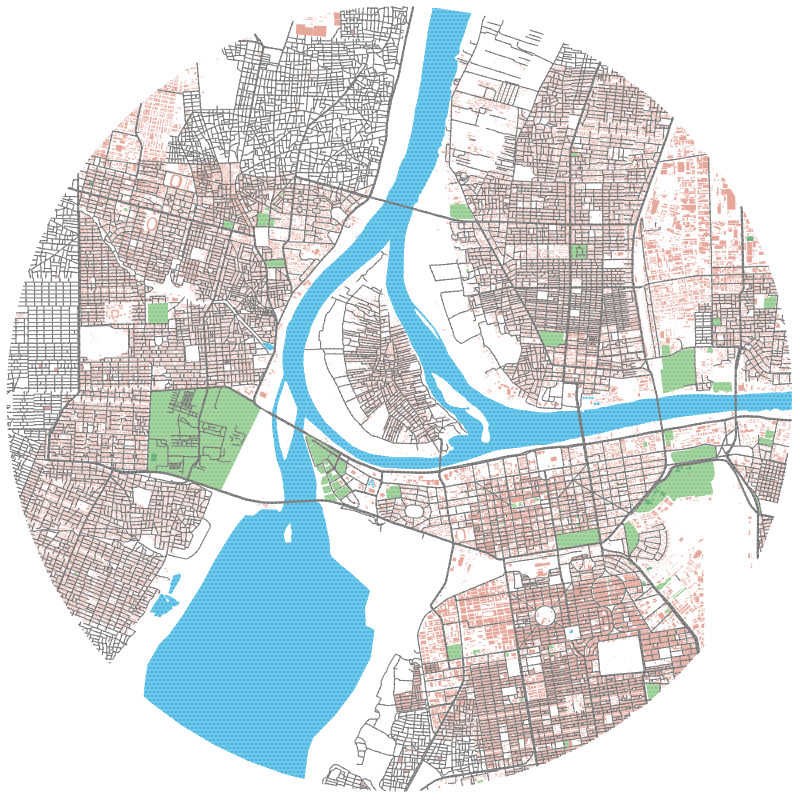

The KhartouMap Initiative
=========================

We are a social enterprise catalyzing the modernization of Sudan's public transit through mapping, open data, education, and innovation. This repository contains all data and source code related to our work. Read our executive report <a href="https://simplebooklet.com/khartoumap" target="_blank">here</a>.

    

Introduction
------------

# New Transit Mapping Paints a Lively Picture of Khartoum Before the War

Two months before conflict in Sudan broke out, our young enterprising KhartouMap team had spent months on the ground collecting transit data and mapping the semi-formal public transportation network of Khartoum.

We completed the largest mobility study in the capital in over 10 years. For the first time ever, we created a comprehensive map of the informal *muwasalat*, or mini-bus public transit system, serving Khartoum.

But then Sudan descended into war. It is the largest humanitarian crisis in the world, with over 8 million people displaced. Half of the remaining population suffers from acute hunger. The situation is dire, [as reported by the United Nations](https://press.un.org/en/2024/sc15634.doc.htm).

So what began as a project for progress has become our closest baseline for normal before the war.

---

## A Window in Time Through Transit

Sudan – and its capital city, Khartoum – was a country in motion. Bustling streets, lively markets, congested traffic, and scores of public transit riders were common sights.

Khartoum was a capital fighting to redefine itself from a stagnant past through a new generation with high hopes. This aspiration was KhartouMap’s, as well, and the team hoped to be the start of a wave of youth-led projects and initiatives that would help build a better Sudan.

The team worked the busy, sunny streets of the capital, hopping on and off buses to log GPS tracks on mobile phones. They spoke to transit riders, collected survey responses on mobile devices, and hosted talks with thought leaders to spread awareness about the necessity and impact of their work.

KhartouMap’s efforts culminated in the largest transit and mobility study of Khartoum since 2011. The team achieved what only 16 other African cities had been able to do before: getting their transit system maps onto platforms like Google Maps and Apple Maps, and completing it in less than a year.

The KhartouMap project was motivated by the many transit woes facing residents: long lines, rising prices for rider passes, safety on public transport, and the availability of buses.

---

## Why Map the Transit System?

Simply put, because when you are able to see a problem clearly, you can begin to fix it.

This was one of the central beliefs guiding KhartouMap’s work. Prior to this effort, no transit map of Khartoum (a city of over 8 million residents) had ever existed. The only way for residents and visitors alike to navigate the complex public transportation system of the city was by word of mouth.

Transit troubles affected almost everyone in the city. Over 85% of the population uses public transit in Khartoum, the majority of whom rely on it exclusively. Mobility is closely tied to quality of life, health, income potential, and education outcomes. Improving transportation positively impacts entire neighborhoods.

Now imagine trying to fix the vast transit system in Khartoum without knowing for sure where buses were going and coming from, or how riders were really using the system. This is what was happening for years prior to KhartouMap, and still happens in many other rapidly growing cities.

---

## Completing Transit Work Remotely

After the conflict began, the team was forced to stop all on-the-ground activities immediately as fighting raged on with no end in sight.

The intricate network of transit lines and bus stops that were documented in the first phase of the project was now being destroyed. Three of the eight bridges connecting Khartoum have been destroyed or damaged in the war, for example.

Those who had the means and were able to, evacuated. Team members continued to work remotely on the aggregation and analysis of data which they already collected, all while navigating displacement and settling in new communities inside and outside of Sudan.

Over the next several months, with a dataset of 8,000+ responses to the transit survey and successful mapping of 300+ transit routes crisscrossing the city, the team painted a vivid picture of Khartoum’s neighborhoods and transportation access before April 2023.

---

## KhartouMap Transit Map Key Takeaways

Some key insights emerged about transit accessibility across pre-war Khartoum and its localities:

- **Khartoum** locality is the best-served locality for transit access, as most neighborhood areas (67%) are within a 5-minute walk to public transit, followed by Umdurman (40%).
- **Khartoum** locality is 100% served by public transit within a 30-minute walk from any neighborhood, followed by Jebel Awlia (90%) and Karari (73%).
-  **Bahri** (34%), **Umdurman, and Umbada** (31%) are the localities with largest percentage of areas considered transit deserts.

---

### Services & Amenities

- **Khartoum** locality has the shortest distances to services and amenities that are accessible by public transit, including hospitals, banks, schools, and marketplaces.
- **The typical** travel time on public transit to services and amenities (without traffic) is 8 minutes in Khartoum, 12 minutes in Umdurman, 20 minutes in Bahri, and 43 minutes in Sharg Al Nile.

---

### Ridership

- **The majority** of all transit trips are directed towards **Khartoum** in the morning (70% of transit rides), followed by Umdurman (12%) and Bahri (11%).
- **The average** commute on a single public transit ride is 35 minutes, and the typical distance traveled is 24 km.

---

## Looking Ahead

For now, this data stands as a testament to a moment in time rather than a roadmap for next steps. Khartoum and all of Sudan have an immense challenge ahead of surviving and rebuilding from the conflict.

However, a hopeful sliver remains: a nation that once built itself can rebuild itself again. Efforts like KhartouMap, led by young people focused on the future, offer a possible path forward when the time comes to rebuild.