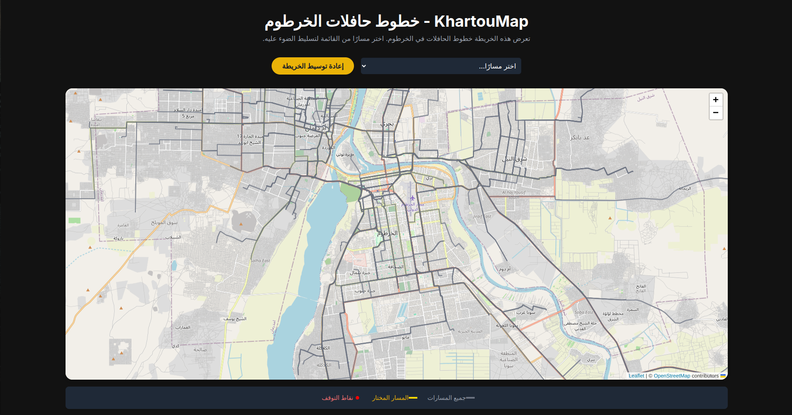

# 🚌 KhartouMap – خطوط حافلات الخرطوم
- Originally designed by [Abdalrahman Molood](https://github.com/amolood): Aug 5, 2025
- Reimplemented with OpenStreetMap by [Khalid Rashad](https://khaldosh.dev/): Aug 6, 2025
- Live Demo: [khartoumap.khaldosh.dev](https://khartoumap.khaldosh.dev/) deployed on render.

An interactive map-based web app reimplemented using OpenStreetMap and Leaflet. [Originally built by Abdalrahman Molood with Google Maps](https://github.com/aabdelhalim/khartoumap/tree/master/contributions/amolood/route-map), this version maintains the same beautiful Arabic interface and right-to-left orientation while leveraging open-source mapping technologies.
The main goal of this project is to let the user explore the transit lines across Khartoum city.

    

---

## 🚀 Features

- 🗺️ **OpenStreetMap & Leaflet** integration for open-source mapping  
- 📍 Highlightable bus routes with color-coded legends  
- 🌐 Arabic interface with RTL support  
- 🧭 "Recenter" button for quick map resets  
- 🎨 Beautiful UI using TailwindCSS and Inter font  
- 📦 Built-in support for ESRI-style route geometry and UTM to Lat/Long conversion via Proj4.js
- 🆓 **100% Open Source** - No API keys required!

---

## 📂 What's Inside?

- `openstreet_route_maps.html`: The main entry point. Includes:
  - Styling via TailwindCSS
  - OpenStreetMap rendering with Leaflet.js
  - Interactive dropdown for route selection
- `bus_routes.json`: Route geometry data
- `bus_stops.json`: Bus stop locations and metadata
- `public`: Public directory for demo website deployment

---

## 🧪 Tech Stack

- **OpenStreetMap** (Open-source map data)
- **Leaflet.js** (Interactive maps library)
- **Tailwind CSS** (Styling framework)
- **Proj4.js** (Geospatial coordinate conversion)

---

## 🛠️ Setup

🎉 **Ready to go out of the box!** 

Since this implementation uses OpenStreetMap and Leaflet, no API keys or registration is required. Simply open `openstreet_route_maps.html` in your browser and start exploring the routes.

🚫 **No build tools, API keys, or local server required!**

---

## 📜 License

This project is licensed under the **MIT License** © 2025

- This project includes third-party components:

  1. Leaflet.js (BSD 2-Clause)
    Copyright (c) 2010-2025, Volodymyr Agafonkin
    License: BSD 2-Clause License

  2. OpenStreetMap Data (ODbL 1.0)
    © OpenStreetMap contributors
    License: Open Database License (ODbL) v1.0
    https://opendatacommons.org/licenses/odbl/1-0/

### Credits & Attribution

- **Original Design**: [Abdalrahman Molood](https://github.com/amolood) - Initial Google Maps implementation
- **OpenStreetMap Reimplementation**: [Khalid Rashad](https://khaldosh.dev/) 
- **Map Data**: © [OpenStreetMap](https://www.openstreetmap.org/) contributors, licensed under [ODbL](https://opendatacommons.org/licenses/odbl/)
- **Mapping Library**: [Leaflet](https://leafletjs.com/) - BSD 2-Clause License