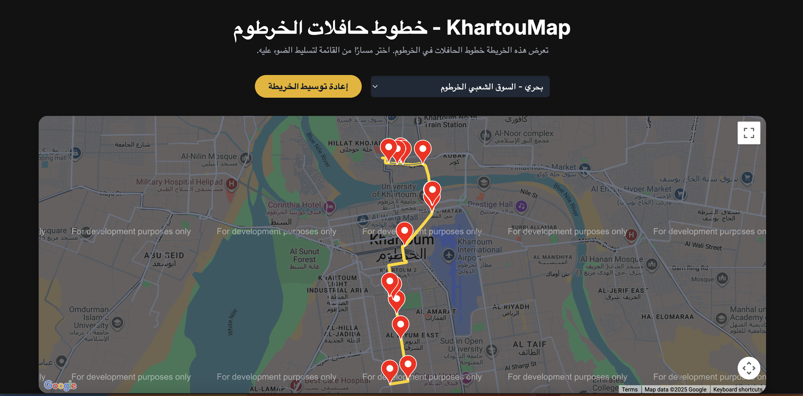

# 🚌 KhartouMap – خطوط حافلات الخرطوم
- Submitted by [Abdalrahman Molood](https://github.com/amolood): Aug 5, 2025
- Approved: Aug 5, 2025
- Merged: Aug 5, 2025

An interactive map-based web app built with a sleek Tailwind CSS frontend and powered by Google Maps API, this project allows users to explore, highlight, and recenter various transit lines across the city – all in Arabic and right-to-left orientation.

    

---

## 🚀 Features

- 🗺️ Google Maps integration for real-time interactivity  
- 📍 Highlightable bus routes with color-coded legends  
- 🌐 Arabic interface with RTL support  
- 🧭 "Recenter" button for quick map resets  
- 🎨 Beautiful UI using TailwindCSS and Inter font  
- 📦 Built-in support for ESRI-style route geometry and UTM to Lat/Long conversion via Proj4.js

---

## 📂 What's Inside?

- `routes.html`: The main entry point. Includes:
  - Pre-loaded JSON route data embedded in JS
  - Styling via TailwindCSS
  - Map rendering logic
  - Interactive dropdown for route selection

---

## 🧪 Tech Stack

- **Google Maps JS API**
- **Tailwind CSS**
- **Proj4.js** (for geospatial coordinate conversion)

---

## 🛠️ Setup

1. Replace '''{api_key}''' in the html script with your Google Maps API (copy/paste your key, with no quotes or brackets). You can create an API at [Google Cloud Console](https://console.cloud.google.com)

🚫 **No build tools or local server required!**

---

## 📜 License

MIT License © 2025