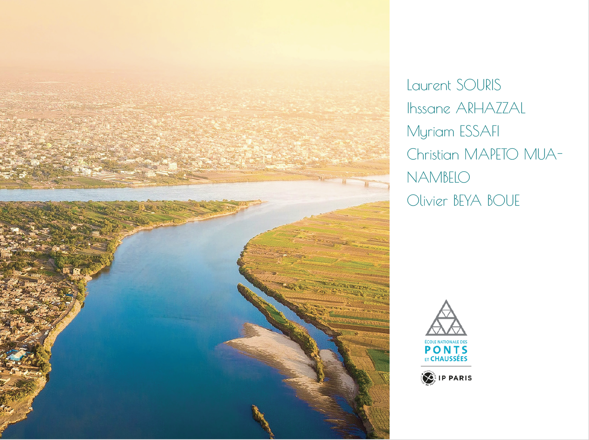

# 🚂 KER – Khartoum Express Railways

    

- Study completed by: Laurent SOURIS, Ihssane ARHAZZAL, Myriam ESSAFI, Christian MAPETO MUA-NAMBELO, Olivier BEYA BOUE
- Institution: Ecole Nationale des Ponts et Chaussées
- Note: This repo hosts the project's executive summary and summary slides. The full *84 page* report including multi-criteria, financial, socio-demographic, and risk analyses can be made available upon request.

A comprehensive pre-feasibility Study study for creating a suburban rail service in Khartoum, Sudan. This project proposes rehabilitating the existing railway line to provide frequent, reliable public transport connecting the city center with growing suburban areas – addressing critical mobility needs in Africa's expanding capitals.

---

## 🚀 Project Overview

- 🚊 **39 km** of rehabilitated railway track (South to North route)
- 🏢 **11 stations** total (3 existing + 8 new stops)
- ⚡ **Hybrid rolling stock** with diesel/battery technology
- 🕐 **15-minute intervals** during peak hours
- 🌍 **Sustainable mobility** solution for 2M+ daily trips
- 💰 **€1.6 billion** total investment (€40M per km)

---

## 🎯 Project Rationale

### Current Challenges (Pre-war)
- **Population Growth**: Expanding suburban areas within 20km radius
- **Traffic Congestion**: Unorganized minibus system and private vehicles
- **Existing Infrastructure**: Derelict railway line with 3 underutilized stations
- **Modal Split**: Heavy reliance on informal transport modes

### Proposed Solution
Multi-criteria analysis identified **Regional Express Railway** as optimal solution over:
- Bus Rapid Transit (BRT)
- Metro system
- Tramway network

---

## 📊 Key Technical Specifications

### Infrastructure
- **Track Gauge**: 1.067m (Cape gauge) - compatible with national network
- **Maximum Speed**: 80 km/h design capacity
- **Double Track**: Upgraded from single track for improved operations
- **Bridges**: 4 new bridges to replace 86+ level crossings
- **Signaling**: Automatic three-way light block system

### Rolling Stock
- **Model**: Alstom Régiolis Hybrid (B 83500 series)
- **Capacity**: 470 passengers per trainset
- **Configuration**: 2-car trains (144m total length)
- **Power**: Hybrid diesel/lithium-ion battery system
- **Range**: 30km battery-only, 1,000km combined
- **Fleet Size**: 13 trains total (including maintenance reserves)

### Service Pattern
- **Operating Hours**: 05:00 - 22:00 (Sunday to Thursday)
- **Peak Frequency**: Every 15 minutes
- **Off-Peak**: 20-30 minute intervals
- **Journey Time**: 57 minutes end-to-end
- **Commercial Speed**: 41.5 km/h average

---

## 💰 Financial Structure

| Component | Cost (€M) | Percentage |
|-----------|-----------|------------|
| Infrastructure | 603 | 35.5% |
| Civil Works | 506 | 29.7% |
| Rolling Stock | 172 | 10.1% |
| Stations & Ticketing | 150 | 8.8% |
| Other Components | 181 | 16.0% |
| **Total CAPEX** | **€1,612** | **100%** |
| **Annual OPEX** | **€89** | **€2.2M/km/year** |

---

## 🌱 Expected Benefits

### Transportation Impact
- **Modal Shift**: 3,750-10,000 passengers per hour per direction
- **Congestion Relief**: Reduced road traffic during peak hours
- **Service Reliability**: Fixed schedules vs. on-demand minibuses
- **Accessibility**: Improved connectivity for vulnerable populations

### Socio-Economic Impact
- **Economic Development**: Enhanced access to employment centers
- **Environmental Benefits**: Reduced carbon footprint
- **Social Equity**: Affordable public transport (4% motorization rate)
- **Urban Planning**: Support for sustainable city development

---

## 🚧 Implementation Context

**Prerequisites**: End of current conflict and political stability
**Deployment Strategy**: Phased approach allowing gradual modal shift
**Maintenance**: Primary facility at Khartoum Central + new southern terminus facility
**Intermodal Integration**: Coordination with existing minibus networks

---

## 🔗 Strategic Alignment

This project supports:
- **National Development**: Railway network rehabilitation as economic lever
- **Resource Connectivity**: Link oil/ore reserves to harbor infrastructure  
- **Urban Sustainability**: Reduced emissions and improved air quality
- **Social Inclusion**: Affordable transport for all income levels

---

## 📈 Long-term Vision

The KER project establishes foundation for:
- **Network Expansion**: Future extensions to other suburban areas
- **Capacity Growth**: Infrastructure sized for increased ridership
- **Technology Evolution**: Platform for advanced rail systems
- **Regional Integration**: Connection to broader Sudan railway network

---

## 📜 License & Credits

This study was conducted as a part of the Advanced Master in Railway and Urban Transport System Engineering at Ecole Nationale des Ponts et Chaussées. This and other projects could be found in the [program's 2024 Yearbook](http://ecoledesponts.fr/sites/ecoledesponts.fr/files/documents/ybstfu24_volume_complet_numerique.pdf)